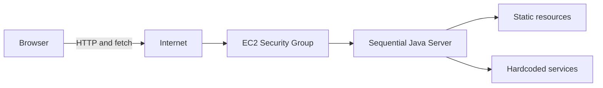
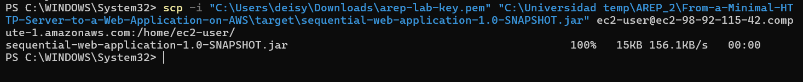
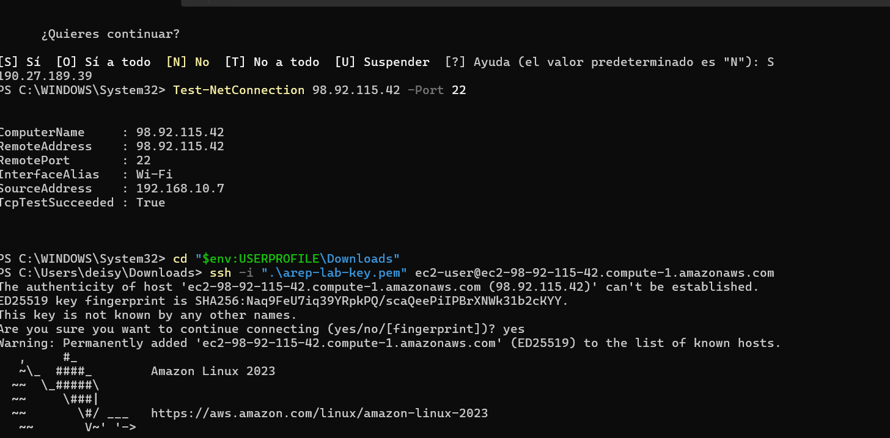
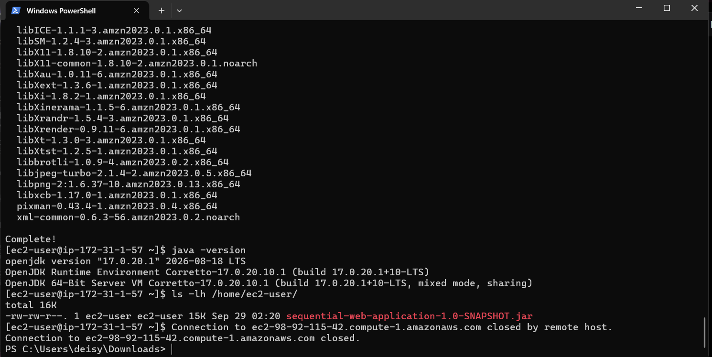
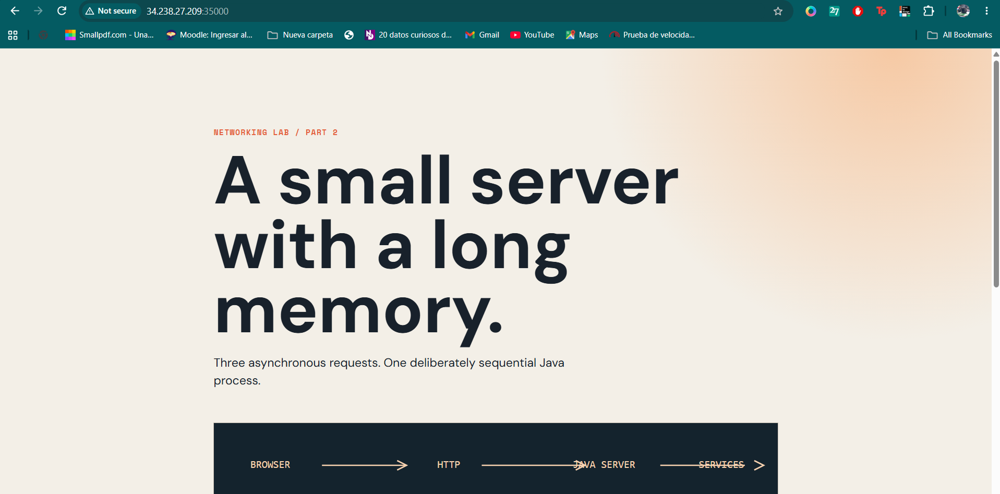
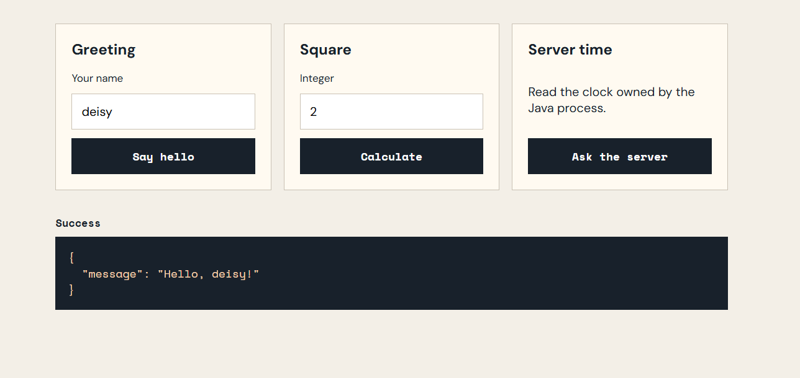
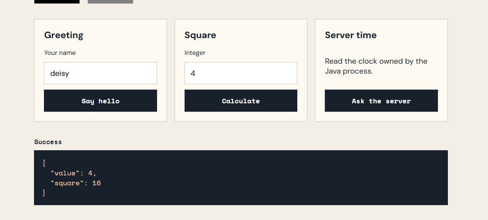
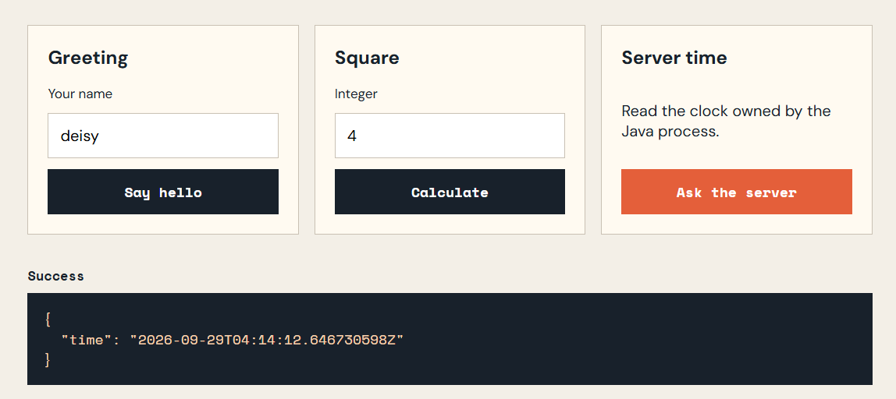
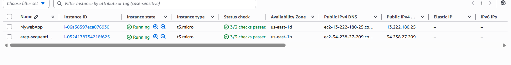

# From a Minimal HTTP Server to a Web Application on AWS

## Autor

Deisy Lorena Guzmán Cabrales

## 1. Descripción

Esta aplicación es el resultado del laboratorio de redes de AREP. Extiende un servidor HTTP mínimo construido con Java hasta convertirlo en una pequeña aplicación web desplegada en una única instancia Amazon EC2.

El servidor:

- Atiende conexiones de forma secuencial, sin hilos ni concurrencia.
- Sirve HTML, CSS, JavaScript, SVG, PNG y JPEG.
- Expone servicios JSON hardcoded para saludo, cálculo, hora y salud.
- Valida métodos, entradas y rutas inseguras.
- Puede ejecutarse localmente y en una instancia EC2.

La aplicación es una línea base educativa. No es un servidor HTTP de producción y no incluye autenticación, base de datos, balanceador, contenedores ni autoscaling.

## 2. Metáfora del sistema

El sistema funciona como una **ventanilla única**. El navegador entrega una solicitud HTTP; la ventanilla lee la ruta, devuelve un archivo o prepara una respuesta JSON y solo después atiende a la siguiente solicitud.

La metáfora representa la decisión principal del laboratorio: JavaScript puede enviar solicitudes de forma asíncrona y mantener la página activa, pero el servidor Java sigue procesando una conexión a la vez.

## 3. Arquitectura



| Componente | Responsabilidad |
|---|---|
| Navegador | Carga recursos y muestra la interfaz. |
| `app.js` | Envía solicitudes con `fetch` y actualiza el resultado sin recargar la página. |
| `Main` | Abre el `ServerSocket`, acepta conexiones y procesa una conexión completa antes de aceptar otra. |
| `HttpRequest` | Interpreta método, ruta y parámetros de consulta. |
| `RequestHandler` | Selecciona servicios hardcoded o recursos estáticos. |
| `HttpResponse` | Escribe estado, tipo MIME, longitud y cuerpo como bytes. |
| EC2 Security Group | Permite SSH por el puerto `22` y tráfico de la aplicación por el puerto `35000`. |
| EC2 | Proporciona el host remoto donde se ejecuta el mismo JAR probado localmente. |

## 4. Decisiones de diseño

### Servidor secuencial

El servidor no crea hilos ni utiliza un pool. El socket de escucha permanece abierto, pero cada socket de cliente se atiende completamente y se cierra antes de aceptar el siguiente. Esto permite observar la limitación de capacidad que se resolvería en una etapa posterior con concurrencia.

### Rutas hardcoded

Las rutas especiales se reconocen mediante condiciones directas. Esta decisión hace visible la relación entre URL y comportamiento, que es el objetivo del laboratorio. No se utiliza un framework de routing ni reflexión.

### Recursos como bytes

Todos los recursos se leen y envían como bytes. Esto permite calcular correctamente `Content-Length` y evita tratar imágenes PNG o JPEG como texto.

### Seguridad

El servidor solo acepta `GET`, valida parámetros, escapa valores antes de insertarlos en JSON y rechaza rutas con `..` o barras invertidas para impedir salir del área pública.

### Cliente asíncrono

El navegador utiliza `fetch` y `preventDefault()`. Mientras espera una respuesta muestra un estado de carga y, cuando responde el servidor, actualiza únicamente el área de resultado.

## 5. Estructura del proyecto

```text
src/main/java/edu/arep/web/  Código del servidor HTTP
src/main/resources/public/    HTML, CSS, JavaScript e imágenes
src/test/java/edu/arep/web/   Pruebas automatizadas
target/                        Artefactos generados por Maven, no se versiona
docs/evidence/                 Capturas de la demostración final
```

## 6. Requisitos

- Java 17 o superior.
- Maven 3.9 o superior.
- Navegador web moderno.
- Cuenta AWS Academy y permisos para crear una instancia EC2.

## 7. Instalación y construcción

```bash
git clone <URL_DEL_REPOSITORIO>
cd From-a-Minimal-HTTP-Server-to-a-Web-Application-on-AWS
mvn clean test
mvn package
```

El artefacto generado es:

```text
target/sequential-web-application-1.0-SNAPSHOT.jar
```

El JAR contiene los recursos públicos y no necesita dependencias externas para ejecutarse.

## 8. Ejecución local

El puerto predeterminado es `35000`. El servidor escucha en `0.0.0.0`, por lo que también puede recibir conexiones desde EC2.

```bash
java -jar target/sequential-web-application-1.0-SNAPSHOT.jar --host 0.0.0.0 --port 35000
```

Abra:

```text
http://localhost:35000/
```

Para detener el servidor, presione `Ctrl+C`.

## 9. Servicios disponibles

| Método | Ruta | Entrada | Respuesta exitosa | Error esperado |
|---|---|---|---|---|
| `GET` | `/api/greeting?name=Ada` | Nombre no vacío | JSON con saludo | `400` si falta `name` |
| `GET` | `/api/square?value=7` | Número entero | JSON con valor y cuadrado | `400` si es inválido |
| `GET` | `/api/time` | Ninguna | Hora actual del servidor | `405` si no es GET |
| `GET` | `/api/health` | Ninguna | `{"status":"ok"}` | `405` si no es GET |

Además:

- Un archivo inexistente produce `404 Not Found`.
- Un método diferente de `GET` produce `405 Method Not Allowed`.
- Una ruta insegura produce `400 Bad Request`.
- Los recursos tienen tipos MIME correctos: HTML, JavaScript, PNG, JPEG y JSON.

## 10. Pruebas automatizadas

Ejecute:

```bash
mvn clean test
```

Las pruebas verifican el parser HTTP, los servicios, la validación de parámetros, el escape JSON, los tipos MIME, los recursos binarios, los archivos inexistentes y el rechazo de path traversal.

## 11. Despliegue en AWS EC2

### 11.1. Configuración de red

Se utiliza una sola instancia EC2 con una IP pública. El Security Group permite:

| Regla | Puerto | Fuente |
|---|---:|---|
| SSH | `22` | IP pública del estudiante o `My IP` |
| Custom TCP | `35000` | IP pública del estudiante o rango aprobado por el instructor |

El puerto `22` es únicamente para administración. El puerto `35000` es para la aplicación.

### 11.2. Instalar Java en EC2

Para Amazon Linux:

```bash
sudo dnf install -y java-17-amazon-corretto
java -version
```

### 11.3. Transferir y ejecutar

Desde PowerShell local:

```powershell
scp -i "C:\ruta\arep-lab-key.pem" `
  "target\sequential-web-application-1.0-SNAPSHOT.jar" `
  ec2-user@<DNS_PUBLICO_EC2>:/home/ec2-user/
```

En la instancia:

```bash
java -jar /home/ec2-user/sequential-web-application-1.0-SNAPSHOT.jar \
  --host 0.0.0.0 \
  --port 35000
```

La aplicación remota se prueba en:

```text
http://<IP_PUBLICA_EC2>:35000/
```

La IP pública puede cambiar si la instancia se detiene y se inicia nuevamente. Por eso se debe copiar la dirección actual desde la consola de EC2.

### 11.4. Validación desde la instancia

```bash
curl -i http://localhost:35000/api/health
curl -i http://localhost:35000/api/greeting?name=Ada
curl -i http://localhost:35000/api/square?value=7
```

## 12. Evidencias de la entrega


















