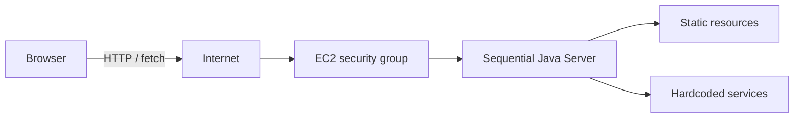

# Sequential Web Application on AWS

Mini aplicación web para el laboratorio de redes de AREP. Un servidor Java basado en `ServerSocket` atiende una conexión completa antes de aceptar la siguiente. Sirve HTML, JavaScript, SVG, PNG y JPEG desde el classpath, y expone cuatro servicios JSON hardcoded.

## Metáfora y arquitectura

El sistema es una **ventanilla única**: el navegador entrega una solicitud HTTP, la ventanilla la clasifica por su ruta, devuelve un recurso estático o prepara un recibo JSON, y solo después atiende a la siguiente persona. La metáfora hace visible la restricción principal: JavaScript puede esperar de forma asíncrona en el navegador, pero la ventanilla sigue siendo secuencial.



- El navegador carga `index.html`, `app.js`, estilos e imágenes mediante solicitudes separadas.
- `app.js` usa `fetch`, valida entradas y actualiza solo las áreas de estado y resultado.
- `Main` mantiene un `ServerSocket` abierto y procesa cada cliente en el hilo principal.
- `RequestHandler` selecciona directamente los servicios `/api/greeting`, `/api/square`, `/api/time` y `/api/health`; las demás rutas buscan un recurso público.
- `HttpResponse` escribe bytes, tipo MIME, estado y longitud exacta.
- EC2 aporta el host remoto y el security group; no cambia la arquitectura de la aplicación.

## Decisiones de diseño

El servidor permanece secuencial para observar la espera y establecer una línea base antes de introducir concurrencia. Las rutas son condiciones explícitas para que el flujo URL -> comportamiento sea visible. Los tipos se seleccionan por extensión y todos los cuerpos se envían como bytes. Las rutas con `..` o barras invertidas se rechazan antes de buscar recursos. El cliente es asíncrono para que la página permanezca interactiva mientras el servidor responde.

## Estructura

```text
src/main/java/edu/arep/web/  servidor, parser y respuestas
src/main/resources/public/    HTML, JavaScript, CSS e imágenes
src/test/java/edu/arep/web/   pruebas unitarias del contrato HTTP
```

## Requisitos, instalación y build

- Java 17 o superior
- Maven 3.9 o superior
- Navegador moderno

```bash
git clone <repository-url>
cd From-a-Minimal-HTTP-Server-to-a-Web-Application-on-AWS
mvn clean test
mvn package
```

El artefacto es `target/sequential-web-application-1.0-SNAPSHOT.jar` y contiene los recursos públicos. No requiere dependencias en tiempo de ejecución.

## Ejecución local

El puerto predeterminado es `35000`; se puede cambiar con `PORT` o `--port`. El host predeterminado es `0.0.0.0`, necesario para EC2.

```bash
java -jar target/sequential-web-application-1.0-SNAPSHOT.jar --port 35000
```

Abra `http://localhost:35000/`. Detenga con `Ctrl+C`.

Servicios:

| Ruta | Entrada | Éxito | Error |
|---|---|---|---|
| `/api/greeting?name=Ada` | `name` no vacío | JSON con saludo | `400` si falta |
| `/api/square?value=7` | entero | JSON con `value` y `square` | `400` si no es entero |
| `/api/time` | ninguna | JSON con hora del servidor | `405` si no es GET |
| `/api/health` | ninguna | `{"status":"ok"}` | `405` si no es GET |

Archivos ausentes producen `404`; métodos distintos de GET producen `405`; rutas inseguras producen `400`. El nombre se escapa antes de entrar al JSON.

## Pruebas y evidencia

Automatizadas: `mvn clean test`. Manualmente, revise DevTools > Network para confirmar solicitudes separadas de documento, script, imágenes y JSON, sus tipos y estados. Pruebe también `/missing.html`, `POST /api/time` y `/../pom.xml`. Para evidenciar la limitación secuencial, agregue temporalmente una espera al servicio, capture el timestamp de dos ventanas y muestre que la segunda conexión espera a la primera.

## AWS EC2

Use únicamente la cuenta, región, imagen y tamaño aprobados por el instructor. Cree una instancia Linux, permita SSH solo desde su IP si aplica y abra únicamente el puerto `35000` requerido por la práctica. Transfiera el JAR, instale Java 17 y ejecute:

```bash
java -jar sequential-web-application-1.0-SNAPSHOT.jar --host 0.0.0.0 --port 35000
```

Valide primero dentro de EC2 con `curl http://localhost:35000/api/health` y luego desde el navegador usando la IP pública. Para una ejecución administrada use el mecanismo aprobado (por ejemplo `systemd`), con logs en una ruta conocida. Nunca guarde claves, tokens o credenciales en Git. Antes de terminar la práctica detenga el proceso, termine la instancia, libere una Elastic IP si existe, elimine el security group cuando ya no esté en uso y revise costos.

## Limitaciones, autor y reconocimiento

No hay hilos, base de datos, autenticación, router general, balanceador ni autoscaling. Solo se admite GET y el servidor no es de producción. Autor: estudiante AREP. Reconocimiento: documentación oficial de Java, Maven y AWS EC2; asistencia de herramientas de desarrollo usada para revisar la implementación.
